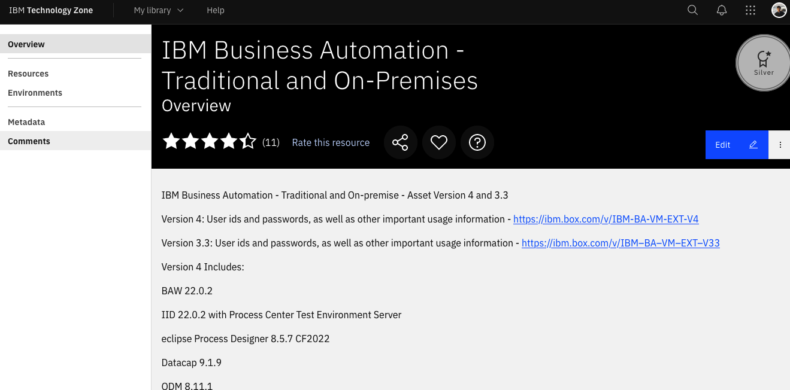
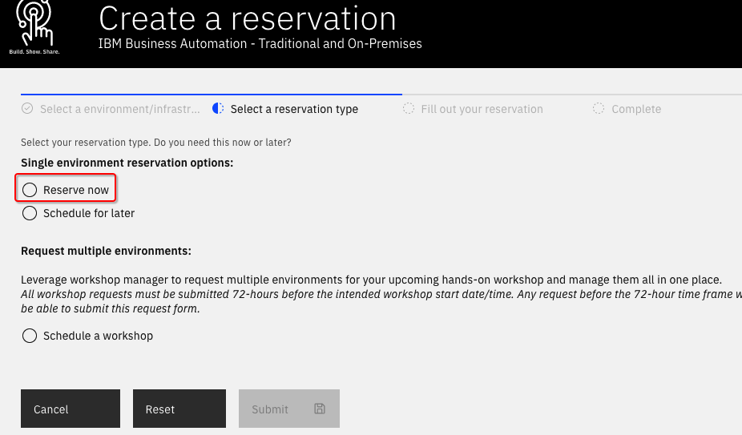
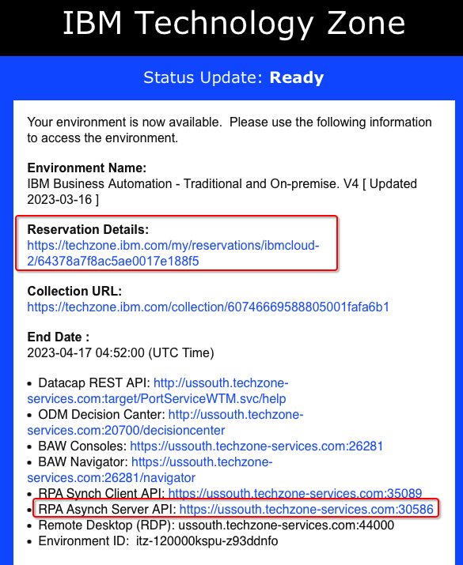
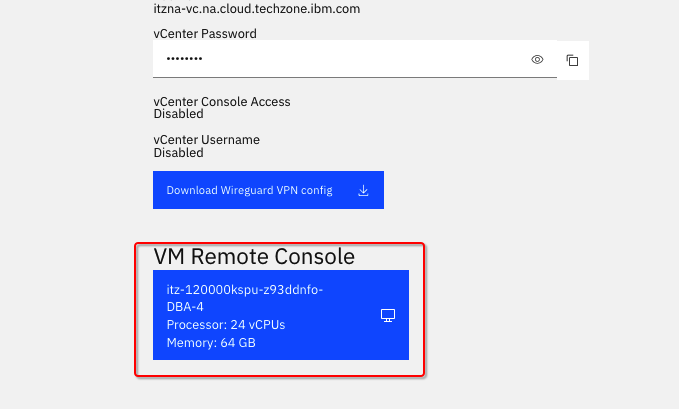

# Step 3 - Setup the RPA Server

**Note:** You only need to perform these steps if you want to demo the RPA execution. You can choose to skip the execution of the RPA bot when you import the Workflow solution.

1. Reserve an environment from [here](https://techzone.ibm.com/collection/ibm-business-automation-traditional-and-on-premise) using your IBMID.
   
2. Click **Environments** on the left panel, and then click **computer icon**.  
   
3. Click **Reserve for now**, then click **Submit**.  
   
4. On the reservation page, make the appropriate selections as below. Once done, click **Submit**.  
   
5. Once you have reserved an environment, you will receive an email with a link to check your reservation details (**Reservation Details**). It also contains a **URL to access the IBM RPA Rest Service remotely**, please copy the **RPA Asynch Server API** URL . This will be used in the Workflow solution.  
   
6. Click the **Reservation Details** above to open your environment reservation details, then click **VM Remote Console** to access your RPA VM where RPA bot will be executed..  
   

Once you have setup the RPA server, [import the Workflow solution](Step%204%20-%20Workflow%20Solution.md).
