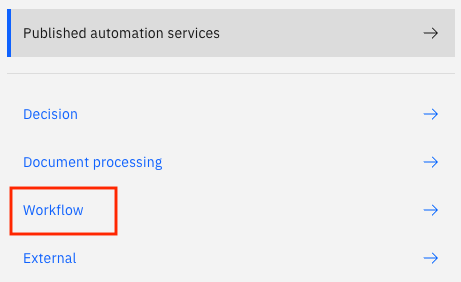
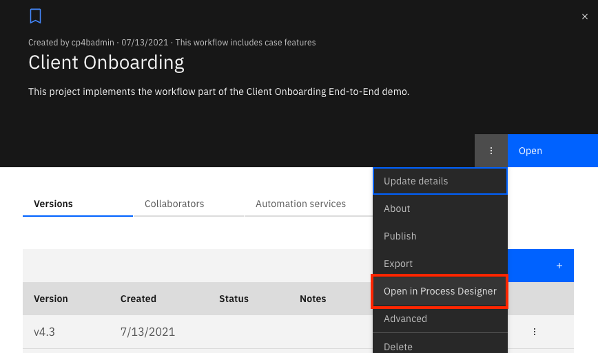
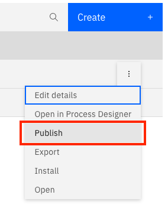
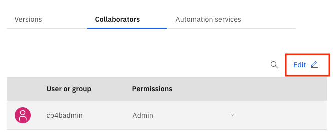

# Step 4 - Import the Workflow Solution

### Pepare the environment for the end-to-end scenario

1. Download the [Workflow twx file](Solution%20Exports/Business%20Automation%20Workflow/Client_Onboarding.twx).

2. Login to **IBM Business Automation Studio**

3. In the top-left corner, click on the menu icon and go to **Business automations**.

   

4. Click on **Workflow**.

   

5. Click on the **Import** button.

6. Click on **Browse** and select the twx file downloaded in Step 1. 

7. Click on OK.

8. Once the import completes, click on tile for the **Client Onboarding** Workflow project (Don't click on the open button but just the tile).

9. Click on the 3-dot menu next to the Open button on the right and select **Open in Process Designer**

   

   Note: The version numbers and dates in the screenshots maybe different from what you see in your system

10. In Process Designer, click on the **Environment Variables** tab.

11. Fill out credentials for a gmail account in the **emailID** and **emailPassword** fields under the **Default** column. Note that the password here must be an [App Password](https://support.google.com/accounts/answer/185833?hl=en) and not your gmail password. 

    

12. If you are showcasing ADP as a part of the scenario, enter the ADP host, username, password, and projectID in their respective fields. If you are not, set **adpEnabled** to false.

13. For the **documentUploadPage** environment variable, enter the URL for the navigator admin and replace the `admin` at the end with `CODocumentUpload`. You will add this desktop to the navigator in a later step.

14. The RPA bot is currently only executed if the user running the scenario matches the **rpaBotExecutionUser**. You can change this by updating the value of the **rpaBotExecutionUser** environment variable.

15. If you are executing the RPA bot, update the value for the **rpaServer** environment variable from the environment you reserved using the previous step.

16. The default target object store name is **BAWTOS**. If you have changed this, update the value for the **tosName** environment variable. Demo environments have the default target object store name of **TARGET**.

17. In the top-right corner, click on the **Finish Editing** button.

    

18. In the top-left corner, click on **Business automations** to go back to the BA Studio.

    

19. Click on **Open** for the **Client Onboarding** Workflow automation project to open it in the Case Builder.

    

20. In the top-right corner, click on the **Deploy** button. The deployment will take a few seconds. Wait until there is a green checkmark next to the button.

    

21. In the top-left corner, click on **Automations** to go back to the BA Studio.

    

22. Click on the tile for the **Client Onboarding** Workflow automation project.

23. Click on the 3-dot menu for latest version of the project and click on **Publish**.

    

24. Close the dialog that shows that the automation services were published successfully.

### Prepare a shared environment for labs

1. In BA Studio, within Business Automations --> Workflow, click on **Toolkits**.

   

2. Click on the tile for the **Client Onboarding Toolkit** toolkit.

3. Click on the **Collaborators** tab.

4. Click on the **Add** button.

   

5. Select the **Group** radio button.

6. Search for the group that contains your shared users (eg: cp4bausers) and select the checkbox for the result.

   

7. Click on the **Add** button to close the dialog.

8. Follow the same step to grant access to **IBM RPA Toolkit** toolkit.

Once you have imported the Workflow solution, [import the required objects in Filenet Content Manager](Step%205%20-%20Content%20Manager.md).

