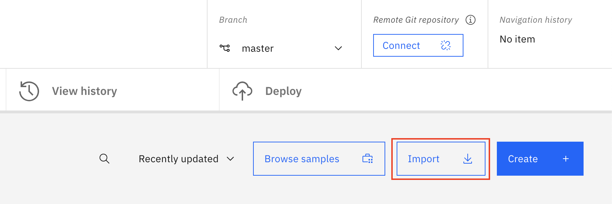

# Step 2 - Import the ADS Project

1. Download [ClientOnboardingDecisions.zip](https://github.com/IBM/cp4ba-client-onboarding-scenario/blob/main/Solution%20Exports/Automation%20Decision%20Services/ClientOnboardingDecisions.zip)

2. Create an empty GIT repo and get its URL and API Key

3. Open IBM Business Automation Studio

4. Click to the menu in the upper-left corner and go to `Design` --> `Business Automations`

5. Click on `Create` --> `Decision Automations`

6. Provide `Client Onboarding` as the project name and click `Create`

7. Once the editor loads, click on `Import` and import the previously downloaded file ClientOnboardingDecisions.zip into the project

   

8. Click on `Connect` and enter the references of the GIT repo previously created

 

8. Click on `Connected` under `Remote Git repository`

9. In the `Machine learning providers` tab, click on `New`

10. In the dialog, select `Open Prediction Service` as the `Type`

11. Enter `OPS` as the name

12. Use the ADS ML Service (Open Prediction Service) URL in the `URL` field

13. Click on `Test Connection`

 

14. Click on `Save`

15. Go back to the `Client Onboarding` project

16. Open `Client Onboarding Decisions`

17. Go to the `Predictive models` tab and open `Machine learning scoreboard`

18. Click on `Connect` and select `OPS`

19. Expand the `service-payment-default-risk` ML model and select the `service-payment-default-risk` deployment

 


20. Click `Next` and go to `Test invocation`

21. Test the decision by entering the following values:

    - clientAnnualRevenue: 15708854
    - clientExistenceDuration: 12
    - clientEmployeeNumber: 3
    - clientIndustry: 0

22. Click on `Run`

23. Verify that the output matches the following:

    ```
    {
        "result": {
            "predictions": 1,
            "scores": [
                0.014675209287711932,
                0.9853247907122881
            ]
        }
    }
    ```


 

24. Click on `Next`

25. Click on `Generate from test output` then click `OK`

26. Click on `Apply` in the upper-right corner

27. Under `Share changes` at the top, click on the number of changes, select all and click `Share`

28.  In the `View history` tab, create a new version named `v1.1`

29. In the `Deploy` tab, expand `v1.1`, click on `Deploy` and wait for deployment to complete


30. Back in the studio, go to `Design` --> `Business Automations` -->`Decisions` and click on the `Client Onboarding` Decision project

31. Select the three-dot menu for `v1.1` and click on `Publish`

Once you have setup the ADS project, import the Workflow solution.

